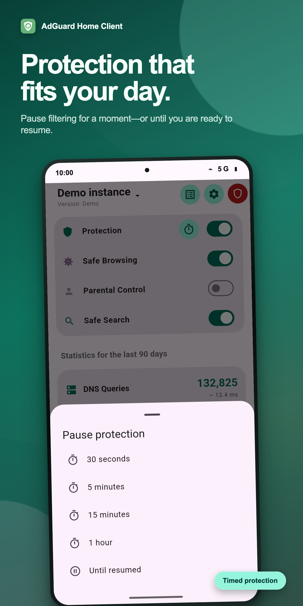
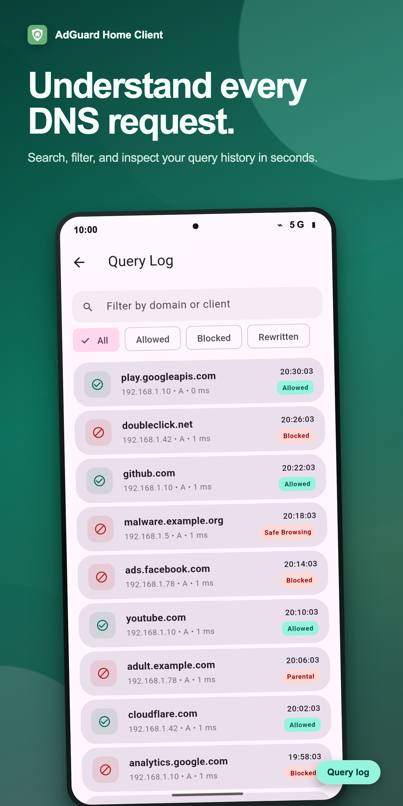
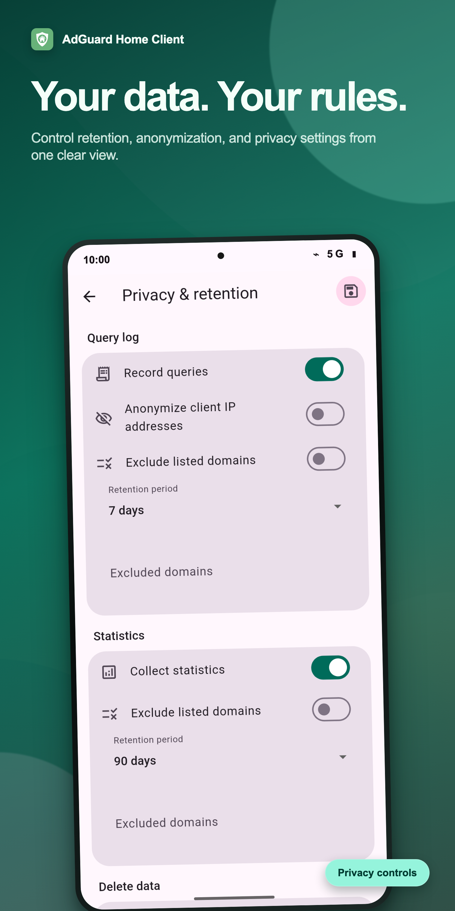
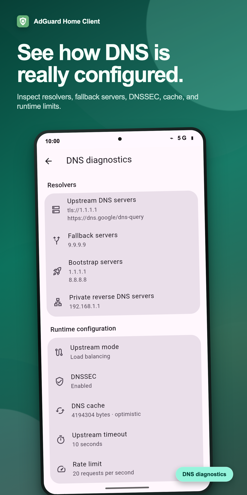
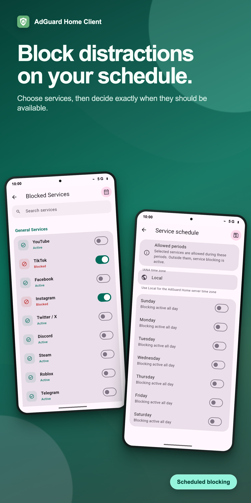
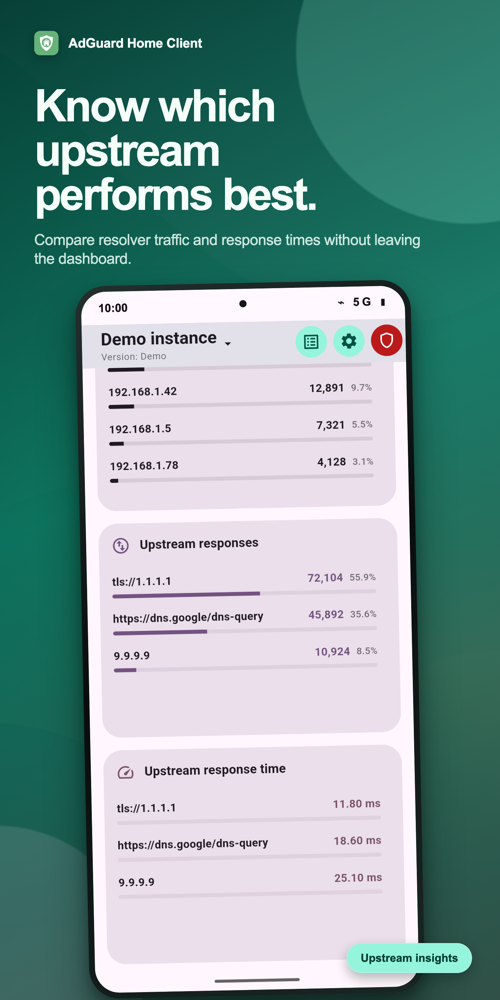
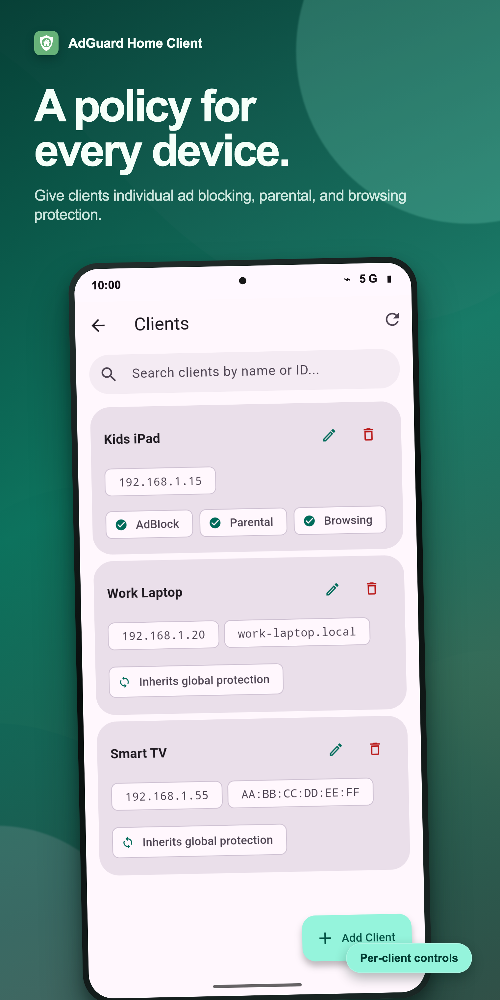
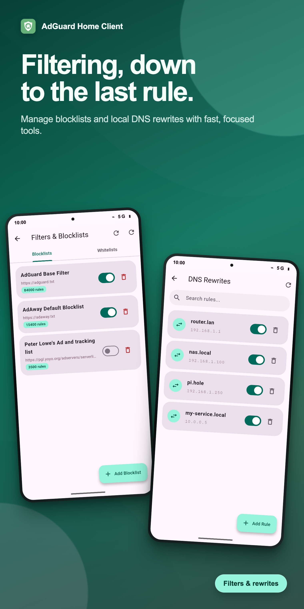

<p align="center">
  
</p>

<h1 align="center">AdGuard Home Client</h1>

<p align="center">
  An Android remote for monitoring and controlling your AdGuard Home instances.
</p>

<p align="center">
  <a href="https://github.com/Medformatik/adguard_home_client/releases/latest"></a>
  <a href="LICENSE"></a>
</p>

<p align="center">
  <a href="https://play.google.com/store/apps/details?id=de.medformatik.adguard_home_client"></a>
  &nbsp;
  <a href="https://apps.obtainium.imranr.dev/redirect.html?r=obtainium://add/https://github.com/Medformatik/adguard_home_client"></a>
</p>

## Features

- **Multi-instance support.** Configure multiple AdGuard Home servers, switch between them from the AppBar, and manage their connection and TLS settings independently.
- **Unified view.** Aggregate statistics and query-log entries across every configured instance. Shared protection toggles apply to all instances and clearly indicate mixed states.
- **Statistics dashboard.** Monitor DNS queries, filtering, Safe Browsing, parental controls, Safe Search, and upstream resolver response counts and latency through trend charts and top-N tables.
- **Query log.** Search by domain or client, filter allowed, blocked, and rewritten requests, load older entries incrementally, and filter by source instance in Unified mode. Query details can be used to quickly block, unblock, or allow a domain.
- **Protection controls.** Toggle master protection, Safe Browsing, parental controls, and Safe Search. Master protection can be paused for a chosen duration and resumed early.
- **Filters and custom rules.** Enable and manage subscription blocklists and allowlists, refresh filter data, and edit custom filtering rules.
- **Client management.** Add, edit, and delete persistent clients with per-device filtering, Safe Browsing, parental control, Safe Search, tags, and privacy settings.
- **DNS rewrites.** Add, enable, disable, and remove custom domain rewrites.
- **Blocked services.** Search and toggle supported services, then configure weekly periods during which selected services are temporarily allowed.
- **Privacy and retention.** Configure query logging and statistics collection, retention periods, client-IP anonymization, and domain exclusions. Query logs and statistics can also be cleared independently.
- **DNS diagnostics.** Inspect resolver and cache configuration, test every configured upstream DNS server, and clear the DNS cache.
- **HTTPS / TLS** with an optional `Verify TLS certificate` toggle for self-signed certificates.
- **Material 3 Expressive UI** with Material You dynamic colors, light/dark/system modes, pull-to-refresh, and humanized numbers.

Server configuration screens operate on one AdGuard Home instance at a time. Select a specific instance before managing clients, filters, rewrites, blocked services, privacy settings, or DNS diagnostics. Unified mode is intended for aggregated monitoring and shared protection controls.

## Install

- **Google Play:** [play.google.com/store/apps/details?id=de.medformatik.adguard_home_client](https://play.google.com/store/apps/details?id=de.medformatik.adguard_home_client)
- **APK from GitHub:** every tagged release ships a signed `app-release.apk`. Grab it from the [latest release](https://github.com/Medformatik/adguard_home_client/releases/latest).
- **[Obtainium](https://github.com/ImranR98/Obtainium):** tap the badge above, or paste this into Obtainium's "Add App" → "App source URL" field:
  ```
  https://github.com/Medformatik/adguard_home_client
  ```

## Screenshots

<p>
  
  
  
  
  
  
  
  
</p>

## Setup

1. Open the app and tap **Add instance**.
2. Enter the AdGuard Home host (IPv4, IPv6, or domain), port (default `3000`), username and password.
3. Toggle **Use HTTPS** if your instance is reachable over TLS. For self-signed certificates, also disable **Verify TLS certificate**.
4. Save. The app verifies the connection and loads the latest protection state and statistics.
5. Add more instances any time and switch between them via the AppBar title — or pick **Unified** to aggregate them all.

## Build from source

Requires Flutter 3.44 or newer with Dart 3.12 or newer.

```bash
git clone https://github.com/Medformatik/adguard_home_client.git
cd adguard_home_client
flutter pub get
flutter run
```

Build a release APK with:

```bash
flutter build apk --release
```

Before submitting changes, format and validate the project with:

```bash
dart format lib test
flutter analyze
flutter test
```

For signed builds you'll need an `android/key.properties` pointing at your keystore (see [Flutter's signing guide](https://docs.flutter.dev/deployment/android#signing-the-app)). The repo's `android/.gitignore` excludes `key.properties` and `*.jks` so credentials never reach the repo.

The generated API client under `lib/generated_api` is committed so a clean checkout can build without running code generation. After changing `assets/openapi.yaml` or `swagger_parser.yaml`, regenerate it with:

```bash
dart run swagger_parser
dart run build_runner build
dart format lib/generated_api
```

## ⚠️ DISCLAIMER ⚠️

This is an unofficial app. The development of the AdGuard Home software is not related with this application in any way.
